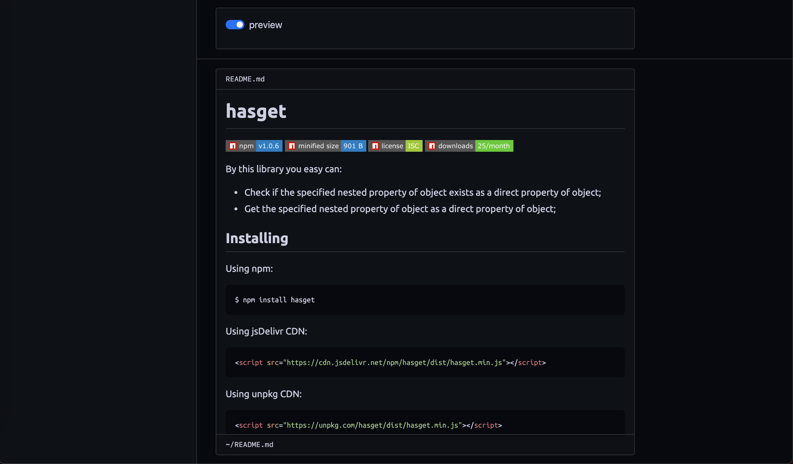
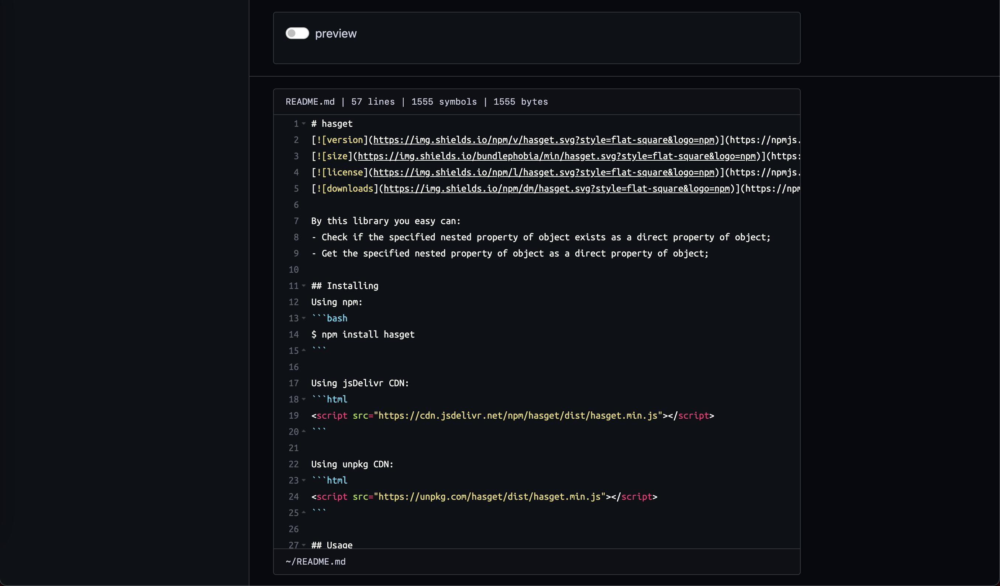

### Installing

```bash
$ cp .env.example .env
$ yarn
```

### Usage

```bash
$ yarn serve # to run server
$ yarn watch # to run watcher
$ yarn lint  # to run eslint
$ yarn test  # to run jest
$ yarn build # to build dist
```

### Screenshots



